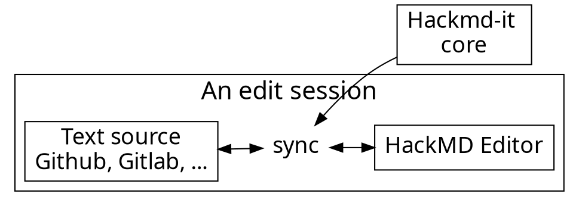

<style>
    .left {
        text-align: left;
    }
    .smol {
        font-size: 24px;
    }
    .reveal pre {
        height: 100%;
        width: 100%;
    }
</style>

<!-- .slide: data-background="https://github.com/RaekwonIII/moonbeam-workshop/raw/main/cover_bg.png" -->

<!--  -->
# Building a unified API

## For indexing EVM and Substrate data with Subsquid

Slides available here
https://tinyurl.com/subsquid-moonbeam

---

<!-- .slide: data-background="https://github.com/RaekwonIII/moonbeam-workshop/raw/main/base_bg.png" -->

# Who am I?

### Massimo Luraschi

### Developer Advocate @ Subsquid.io

*  [@RaekwonIII](https://twitter.com/RaekwonIII) 
*  RaekwonIII#3962 
*  [@RaekwonTheChefIII](https://t.me/RaekwonTheChefIII) 
*  [RaekwonIII](https://github.com/RaekwonIII) 

---

<!-- .slide: data-background="https://github.com/RaekwonIII/moonbeam-workshop/raw/main/base_bg.png" -->

  
## Blockchain data problems


Projects need custom data analysis for informed decision making

---

<!-- .slide: data-background="https://github.com/RaekwonIII/moonbeam-workshop/raw/main/base_bg.png" -->

# Monolith vs modular (1)


----

<!-- .slide: data-background="https://github.com/RaekwonIII/moonbeam-workshop/raw/main/base_bg.png" -->

# Monolith vs modular (2)


----

<!-- .slide: data-background="https://github.com/RaekwonIII/moonbeam-workshop/raw/main/base_bg.png" -->

# Monolith vs modular (3)

## Offload heavy lifting to Archives

Note:

* Lower storage requirements, less computing power

----

<!-- .slide: data-background="https://github.com/RaekwonIII/moonbeam-workshop/raw/main/base_bg.png" -->

# Monolith vs modular (4)

## Pre-indexed "queryable" historical data

Note:

* API updates => wait for re-sync
  * Acts like a "blockchain cache"

----

<!-- .slide: data-background="https://github.com/RaekwonIII/moonbeam-workshop/raw/main/base_bg.png" -->

# Monolith vs modular (5)

## Faster than RPC calls

Note:

* Can be scaled, does not depend on the DApp
* Bonus: can use Archives and Processors like LEGOs

---

<!-- .slide: data-background="https://github.com/RaekwonIII/moonbeam-workshop/raw/main/base_bg.png" -->

# Permissive SDK

## Unified Substrate and EVM indexing

Note:

Can track both Substrate Events/Extrinsics AND Evm data in the same API

----

<!-- .slide: data-background="https://github.com/RaekwonIII/moonbeam-workshop/raw/main/base_bg.png" -->

# Permissive SDK

## Full control of database schema

----

<!-- .slide: data-background="https://github.com/RaekwonIII/moonbeam-workshop/raw/main/base_bg.png" -->

# Permissive SDK

## External libs/APIs in your project

E.g. fetch prices from Coikgecko? ✅

----

<!-- .slide: data-background="https://github.com/RaekwonIII/moonbeam-workshop/raw/main/base_bg.png" -->

# Permissive SDK

## Extensions via custom resolvers

---

<!-- .slide: data-background="https://github.com/RaekwonIII/moonbeam-workshop/raw/main/base_bg.png" -->

# Built for devs

## Easy setup, local development

Note:

It's much easier to test, break things, start, stop the server

----

<!-- .slide: data-background="https://github.com/RaekwonIII/moonbeam-workshop/raw/main/base_bg.png" -->

# Built for devs

## Fast sync times

Note:

Fast sync times, because the raw indexing is done by Archives
Build and deploy production-ready APIs within *hours*

----

<!-- .slide: data-background="https://github.com/RaekwonIII/moonbeam-workshop/raw/main/base_bg.png" -->

# Built for devs

## Serverless deployment

---

<!-- .slide: data-background="https://github.com/RaekwonIII/moonbeam-workshop/raw/main/base_bg.png" -->

# Built for devs


Note:

* Generate as much boilerplate possible
* Type-safety of TypeScript
* Focus on business logic
* No manual JSON parsing
* No manual chasing of Runtime upgrades

---

<!-- .slide: data-background="https://github.com/RaekwonIII/moonbeam-workshop/raw/main/base_bg.png" -->

# Codegen

## From schema

```graphql=
type Owner @entity {
  id: ID!
  ownedTokens: [Token!]! @derivedFrom(field: "owner")
  balance: BigInt
}
```

----

<!-- .slide: data-background="https://github.com/RaekwonIII/moonbeam-workshop/raw/main/base_bg.png" -->

# Codegen

## To Models

```typescript=
@Entity_()
export class Owner {
  constructor(props?: Partial<Owner>) {
    Object.assign(this, props)
  }

  @PrimaryColumn_()
  id!: string

  @OneToMany_(() => Token, e => e.owner)
  ownedTokens!: Token[]

  @Column_("numeric", {transformer: marshal.bigintTransformer, nullable: true})
  balance!: bigint | undefined | null
}
```

Note:

Easier to define entities as a schema, code is built automatically

---

<!-- .slide: data-background="https://github.com/RaekwonIII/moonbeam-workshop/raw/main/base_bg.png" -->

# Typegen

## Type-safe wrappers for Substrate

----

<!-- .slide: data-background="https://github.com/RaekwonIII/moonbeam-workshop/raw/main/base_bg.png" -->

## Runtime upgrades


Note:

Runtime upgrades break things...

----

<!-- .slide: data-background="https://github.com/RaekwonIII/moonbeam-workshop/raw/main/base_bg.png" -->

## 👋Runtime upgrade bugs

```typescript=
export class BalancesTransferEvent {
  constructor(private ctx: EventContext) {
    assert(this.ctx.event.name === 'balances.Transfer')
  }

  get isV49(): boolean {
    return this.ctx._chain.getEventHash('balances.Transfer') === 'dfcae516f053c47e7cb49e0718f01587efcb64cea4e3baf4c6973a29891f7841'
  }

  get asV49(): [Uint8Array, Uint8Array, bigint] {
    assert(this.isV49)
    return this.ctx._chain.decodeEvent(this.ctx.event)
  }

  get isV1201(): boolean {
    return this.ctx._chain.getEventHash('balances.Transfer') === '23222c59f2992c12387568241620899d2d399ab9027595daca8255637f62ece3'
  }

  get asV1201(): {from: v1201.AccountId20, to: v1201.AccountId20, amount: bigint} {
    assert(this.isV1201)
    return this.ctx._chain.decodeEvent(this.ctx.event)
  }
}
```

Note:

* Keep track of Runtime changes
* No manual procedure
* Reduce bugs

---

<!-- .slide: data-background="https://github.com/RaekwonIII/moonbeam-workshop/raw/main/base_bg.png" -->

# EVM Typegen

## Type-safe interfaces from ABI deserialization

----

<!-- .slide: data-background="https://github.com/RaekwonIII/moonbeam-workshop/raw/main/base_bg.png" -->

## Type-safe interfaces from ABI deserialization

### From JSON...

```json=
[
    {
      "inputs": [
        {
          "internalType": "string",
          "name": "name",
          "type": "string"
        },
        {
          "internalType": "string",
          "name": "symbol",
          "type": "string"
        },
        {
          "internalType": "string",
          "name": "baseURI",
          "type": "string"
        }
      ],
      "stateMutability": "nonpayable",
      "type": "constructor"
    },
    {
      "anonymous": false,
      "inputs": [
        {
          "indexed": true,
          "internalType": "address",
          "name": "owner",
          "type": "address"
        },
        {
          "indexed": true,
          "internalType": "address",
          "name": "approved",
          "type": "address"
        },
        {
          "indexed": true,
          "internalType": "uint256",
          "name": "tokenId",
          "type": "uint256"
        }
      ],
      "name": "Approval",
      "type": "event"
    },
    {
      "anonymous": false,
      "inputs": [
        {
          "indexed": true,
          "internalType": "address",
          "name": "owner",
          "type": "address"
        },
        {
          "indexed": true,
          "internalType": "address",
          "name": "operator",
          "type": "address"
        },
        {
          "indexed": false,
          "internalType": "bool",
          "name": "approved",
          "type": "bool"
        }
      ],
      "name": "ApprovalForAll",
      "type": "event"
    },
    {
      "anonymous": false,
      "inputs": [
        {
          "indexed": true,
          "internalType": "address",
          "name": "from",
          "type": "address"
        },
        {
          "indexed": true,
          "internalType": "address",
          "name": "to",
          "type": "address"
        },
        {
          "indexed": true,
          "internalType": "uint256",
          "name": "tokenId",
          "type": "uint256"
        }
      ],
      "name": "Transfer",
      "type": "event"
    },
    {
      "inputs": [
        {
          "internalType": "address",
          "name": "to",
          "type": "address"
        },
        {
          "internalType": "uint256",
          "name": "tokenId",
          "type": "uint256"
        }
      ],
      "name": "approve",
      "outputs": [],
      "stateMutability": "nonpayable",
      "type": "function"
    },
    {
      "inputs": [
        {
          "internalType": "address",
          "name": "owner",
          "type": "address"
        }
      ],
      "name": "balanceOf",
      "outputs": [
        {
          "internalType": "uint256",
          "name": "",
          "type": "uint256"
        }
      ],
      "stateMutability": "view",
      "type": "function"
    },
    {
      "inputs": [],
      "name": "baseURI",
      "outputs": [
        {
          "internalType": "string",
          "name": "",
          "type": "string"
        }
      ],
      "stateMutability": "view",
      "type": "function"
    },
    {
      "inputs": [
        {
          "internalType": "uint256",
          "name": "tokenId",
          "type": "uint256"
        }
      ],
      "name": "getApproved",
      "outputs": [
        {
          "internalType": "address",
          "name": "",
          "type": "address"
        }
      ],
      "stateMutability": "view",
      "type": "function"
    },
    {
      "inputs": [
        {
          "internalType": "address",
          "name": "owner",
          "type": "address"
        },
        {
          "internalType": "address",
          "name": "operator",
          "type": "address"
        }
      ],
      "name": "isApprovedForAll",
      "outputs": [
        {
          "internalType": "bool",
          "name": "",
          "type": "bool"
        }
      ],
      "stateMutability": "view",
      "type": "function"
    },
    {
      "inputs": [],
      "name": "name",
      "outputs": [
        {
          "internalType": "string",
          "name": "",
          "type": "string"
        }
      ],
      "stateMutability": "view",
      "type": "function"
    },
    {
      "inputs": [
        {
          "internalType": "uint256",
          "name": "tokenId",
          "type": "uint256"
        }
      ],
      "name": "ownerOf",
      "outputs": [
        {
          "internalType": "address",
          "name": "",
          "type": "address"
        }
      ],
      "stateMutability": "view",
      "type": "function"
    },
    {
      "inputs": [
        {
          "internalType": "address",
          "name": "from",
          "type": "address"
        },
        {
          "internalType": "address",
          "name": "to",
          "type": "address"
        },
        {
          "internalType": "uint256",
          "name": "tokenId",
          "type": "uint256"
        }
      ],
      "name": "safeTransferFrom",
      "outputs": [],
      "stateMutability": "nonpayable",
      "type": "function"
    },
    {
      "inputs": [
        {
          "internalType": "address",
          "name": "from",
          "type": "address"
        },
        {
          "internalType": "address",
          "name": "to",
          "type": "address"
        },
        {
          "internalType": "uint256",
          "name": "tokenId",
          "type": "uint256"
        },
        {
          "internalType": "bytes",
          "name": "_data",
          "type": "bytes"
        }
      ],
      "name": "safeTransferFrom",
      "outputs": [],
      "stateMutability": "nonpayable",
      "type": "function"
    },
    {
      "inputs": [
        {
          "internalType": "address",
          "name": "operator",
          "type": "address"
        },
        {
          "internalType": "bool",
          "name": "approved",
          "type": "bool"
        }
      ],
      "name": "setApprovalForAll",
      "outputs": [],
      "stateMutability": "nonpayable",
      "type": "function"
    },
    {
      "inputs": [
        {
          "internalType": "bytes4",
          "name": "interfaceId",
          "type": "bytes4"
        }
      ],
      "name": "supportsInterface",
      "outputs": [
        {
          "internalType": "bool",
          "name": "",
          "type": "bool"
        }
      ],
      "stateMutability": "view",
      "type": "function"
    },
    {
      "inputs": [],
      "name": "symbol",
      "outputs": [
        {
          "internalType": "string",
          "name": "",
          "type": "string"
        }
      ],
      "stateMutability": "view",
      "type": "function"
    },
    {
      "inputs": [
        {
          "internalType": "uint256",
          "name": "index",
          "type": "uint256"
        }
      ],
      "name": "tokenByIndex",
      "outputs": [
        {
          "internalType": "uint256",
          "name": "",
          "type": "uint256"
        }
      ],
      "stateMutability": "view",
      "type": "function"
    },
    {
      "inputs": [
        {
          "internalType": "address",
          "name": "owner",
          "type": "address"
        },
        {
          "internalType": "uint256",
          "name": "index",
          "type": "uint256"
        }
      ],
      "name": "tokenOfOwnerByIndex",
      "outputs": [
        {
          "internalType": "uint256",
          "name": "",
          "type": "uint256"
        }
      ],
      "stateMutability": "view",
      "type": "function"
    },
    {
      "inputs": [
        {
          "internalType": "uint256",
          "name": "tokenId",
          "type": "uint256"
        }
      ],
      "name": "tokenURI",
      "outputs": [
        {
          "internalType": "string",
          "name": "",
          "type": "string"
        }
      ],
      "stateMutability": "view",
      "type": "function"
    },
    {
      "inputs": [],
      "name": "totalSupply",
      "outputs": [
        {
          "internalType": "uint256",
          "name": "",
          "type": "uint256"
        }
      ],
      "stateMutability": "view",
      "type": "function"
    },
    {
      "inputs": [
        {
          "internalType": "address",
          "name": "from",
          "type": "address"
        },
        {
          "internalType": "address",
          "name": "to",
          "type": "address"
        },
        {
          "internalType": "uint256",
          "name": "tokenId",
          "type": "uint256"
        }
      ],
      "name": "transferFrom",
      "outputs": [],
      "stateMutability": "nonpayable",
      "type": "function"
    }
  ]
```

----

<!-- .slide: data-background="https://github.com/RaekwonIII/moonbeam-workshop/raw/main/base_bg.png" -->

## ABI automated parsing

### ...to TypeScript

```typescript=
export interface TransferAddressAddressUint256Event {
  from: string;
  to: string;
  tokenId: ethers.BigNumber;
}

export const events = {
  // ...
  "Transfer(address,address,uint256)":  {
    topic: abi.getEventTopic("Transfer(address,address,uint256)"),
    decode(data: EvmEvent): TransferAddressAddressUint256Event {
      const result = abi.decodeEventLog(
        abi.getEvent("Transfer(address,address,uint256)"),
        data.data || "",
        data.topics
      );
      return  {
        from: result[0],
        to: result[1],
        tokenId: result[2],
      }
    }
  },
}
```

Note:

* No manual JSON parsing
* Pass data through interfaces

---

<!-- .slide: data-background="https://github.com/RaekwonIII/moonbeam-workshop/raw/main/base_bg.png" -->

## Resources

* [Subsquid Docs](https://docs.subsquid.io)
* [Moonbeam docs](https://docs.moonbeam.network/builders/integrations/indexers/subsquid/)
* [Template project](https://github.com/subsquid/squid-template)
* [Aquarium](https://app.subsquid.io/aquarium)
* [Stackexchange](https://substrate.stackexchange.com/) (subsquid tag):
* Community: [Telegram](https://t.me/HydraDevs) group, [Discord](https://discord.gg/dxR4wNgdjV) server 

---

<!-- .slide: data-background="https://github.com/RaekwonIII/moonbeam-workshop/raw/main/base_bg.png" -->

# Let’s get coding…🦑

---

<!-- .slide: data-background="https://github.com/RaekwonIII/moonbeam-workshop/raw/main/base_bg.png" -->

## Goal: ERC721 tracker

1. Setup<!-- .element: class="fragment" -->
2. Review the schema<!-- .element: class="fragment" -->
3. Generate models<!-- .element: class="fragment" -->
4. Generate Interfaces<!-- .element: class="fragment" -->
5. Implement logic in Processor<!-- .element: class="fragment" -->
6. Launch database container<!-- .element: class="fragment" -->
7. Create and apply database migration<!-- .element: class="fragment" -->
8. Launch processor and GraphQL server<!-- .element: class="fragment" -->

---

<!-- .slide: data-background="https://github.com/RaekwonIII/moonbeam-workshop/raw/main/base_bg.png" -->

<!-- .slide: class="smol" -->
<!-- .slide: class="left" -->

# Setup

* Requisites: [Node.js](https://nodejs.org/en/download/) (16 or later), [Docker](https://docs.docker.com/get-docker/)

* GitHub [template](https://github.com/subsquid/squid-template), *Use this template*, then

```bash
git clone git@github.com:<account>/squid-template.git
```

* Install dependencies from project's root folder

```bash
cd squid-template && npm i
``` 

* Install additional dependencies

```bash
npm i @ethersproject/abi ethers @subsquid/substrate-evm-processor @subsquid/evm-typegen
```

<!-- 

## Bonus points: Makefile

Useful because it provides shortcuts (I can never remember command names)

```cmake [2|5|9-12]
# ...
typegen: moonbeamVersions.json
	@npx squid-substrate-typegen typegen.json

moonbeamVersions.json:
	@make explore

explore:
	@npx squid-substrate-metadata-explorer \
		--chain wss://wss.api.moonriver.moonbeam.network \
		--archive https://moonriver-beta.indexer.gc.subsquid.io/v4/graphql \
		--out moonbeamVersions.json
# ...
```

-->

---

<!-- .slide: data-background="https://github.com/RaekwonIII/moonbeam-workshop/raw/main/base_bg.png" -->

<!-- .slide: class="smol" -->
<!-- .slide: class="left" -->

# Codegen (schema)

Define entities we want to track in `schema.graphql` file in the project root folder

* Token (and token transfers)
* Ownership of tokens
* Contracts and their minted tokens

```graphql=
type Token @entity {
  id: ID!
  owner: Owner
  uri: String
  transfers: [Transfer!]! @derivedFrom(field: "token")
  contract: Contract
}
 
type Owner @entity {
  id: ID!
  ownedTokens: [Token!] @derivedFrom(field: "owner")
  balance: BigInt!
  historicalBalances: [HistoricalBalance!] @derivedFrom(field: "account")
}
 
type Contract @entity {
  id: ID!
  name: String
  symbol: String
  totalSupply: BigInt
  mintedTokens: [Token!]! @derivedFrom(field: "contract")
}
 
type Transfer @entity {
  id: ID!
  token: Token!
  from: Owner
  to: Owner
  timestamp: BigInt!
  block: Int!
  transactionHash: String!
}

type HistoricalBalance @entity {
  id: ID!
  account: Owner!
  balance: BigInt!
  date: DateTime!
}

```

----

<!-- .slide: data-background="https://github.com/RaekwonIII/moonbeam-workshop/raw/main/base_bg.png" -->

<!-- .slide: class="smol" -->
<!-- .slide: class="left" -->

# Codegen (proj structure)

* From project's root folder, launch 
```bash
npx sqd codegen  # or `make codegen`
```
* New files will be created 

----

<!-- .slide: data-background="https://github.com/RaekwonIII/moonbeam-workshop/raw/main/base_bg.png" -->

<!-- .slide: class="smol" -->
<!-- .slide: class="left" -->

# Codegen (classes)

### Let's take the `Owner` entity as an example

```typescript=
import {Entity as Entity_, Column as Column_, PrimaryColumn as PrimaryColumn_, OneToMany as OneToMany_} from "typeorm"
import * as marshal from "./marshal"
import {Token} from "./token.model"
import {HistoricalBalance} from "./historicalBalance.model"

@Entity_()
export class Owner {
  constructor(props?: Partial<Owner>) {
    Object.assign(this, props)
  }

  @PrimaryColumn_()
  id!: string

  @OneToMany_(() => Token, e => e.owner)
  ownedTokens!: Token[]

  @Column_("numeric", {transformer: marshal.bigintTransformer, nullable: false})
  balance!: bigint

  @OneToMany_(() => HistoricalBalance, e => e.account)
  historicalBalances!: HistoricalBalance[]
}

```

---

<!-- .slide: data-background="https://github.com/RaekwonIII/moonbeam-workshop/raw/main/base_bg.png" -->

<!-- .slide: class="smol" -->
<!-- .slide: class="left" -->

# Typegen

Explore the chain metadata

```bash
npx squid-substrate-metadata-explorer \
		--chain wss://wss.api.moonriver.moonbeam.network \
		--archive https://moonriver-beta.indexer.gc.subsquid.io/v4/graphql \
		--out moonriverVersions.json
```

Change `typegen.json` config

```json=
{
  "outDir": "src/types",
  "chainVersions": "moonriverVersions.json",
  "typesBundle": "moonriver",
  "events": [
    "balances.Transfer"
  ],
  "calls": []
}
```

Generate interfaces

```bash
npx squid-substrate-typegen typegen.json
```

----

<!-- .slide: data-background="https://github.com/RaekwonIII/moonbeam-workshop/raw/main/base_bg.png" -->

<!-- .slide: class="smol" -->
<!-- .slide: class="left" -->

# EVM Typegen

* We need the ERC721 ABI to be able to process its logs
* Copy it from [here](https://raw.githubusercontent.com/subsquid/squid/master/test/moonsama-erc721/erc721.json) (or source it elsewhere)
* Create a `src/abi` folder to contain all ABIs
* Paste it into a file named `ERC721.json` in `src/abi`
* From project root folder, launch
```bash
npx squid-evm-typegen --abi src/abi/ERC721.json --output src/abi/erc721.ts
```

Note:
  https://github.com/PureStake/moonbeam-docs/blob/master/.snippets/code/subsquid/erc721.md

----

<!-- .slide: data-background="https://github.com/RaekwonIII/moonbeam-workshop/raw/main/base_bg.png" -->

## TypeScript and linting config

We may need to add this section to the `tsconfig.json`:

```json=
{
  "compilerOptions": {
    ...
    "resolveJsonModule": true
  },
  ...
}
```

And add these configurations to the `.eslint` file:

```typescript=
{
    "prettier/prettier": "off",
    "@typescript-eslint/no-unsafe-assignment": "off",
    "@typescript-eslint/no-unsafe-call": "off",
    "@typescript-eslint/no-unsafe-member-access": "off",
}
```

---

<!-- .slide: data-background="https://github.com/RaekwonIII/moonbeam-workshop/raw/main/base_bg.png" -->

<!-- .slide: class="smol" -->
<!-- .slide: class="left" -->

# Contract

Let's create a new `src/contract.ts` file to handle...well...the Contract :smile: 

```typescript=
import { assertNotNull, Store } from "@subsquid/substrate-evm-processor";
import { ethers } from "ethers";
import * as erc721 from "./abi/erc721";
import { Contract } from "./model";
 
export const CHAIN_NODE = "wss://wss.api.moonriver.moonbeam.network";

export const contract = new ethers.Contract(
  "0xb654611f84a8dc429ba3cb4fda9fad236c505a1a",
  erc721.abi,
  new ethers.providers.WebSocketProvider(assertNotNull(CHAIN_NODE))
);
 
export function createContractEntity(): Contract {
  return new Contract({
    id: contract.address,
    name: "Moonsama",
    symbol: "MSAMA",
    totalSupply: 1000n,
  });
}
 
let contractEntity: Contract | undefined;
 
export async function getContractEntity({
  store,
}: {
  store: Store;
}): Promise<Contract> {
  if (contractEntity == null) {
    contractEntity = await store.get(Contract, contract.address);
  }
  return assertNotNull(contractEntity);
}

```

---

<!-- .slide: data-background="https://github.com/RaekwonIII/moonbeam-workshop/raw/main/base_bg.png" -->

<!-- .slide: class="smol" -->
<!-- .slide: class="left" -->

# Processor logic

Processor logic needs to be updated, we maintain the handling of Substrate Events, but add EVM logs handling. Let's change the file like so:

```typescript=
import {
  EventHandlerContext,
  EvmLogHandlerContext,
  Store,
  SubstrateEvmProcessor,
  toHex
} from "@subsquid/substrate-evm-processor";
import { lookupArchive } from "@subsquid/archive-registry";
import { getAddress } from "@ethersproject/address"
import { CHAIN_NODE, contract, createContractEntity, getContractEntity } from "./contract";
import { events } from "./abi/erc721";
import { Owner, Token, Transfer, HistoricalBalance,} from "./model";
import { BalancesTransferEvent } from "./types/events";

const processor = new SubstrateEvmProcessor("erc721");

processor.setDataSource({
  chain: CHAIN_NODE,
  archive: lookupArchive("moonriver")[0].url,
});

processor.setBatchSize(500);

processor.addPreHook({ range: { from: 0, to: 0 } }, async (ctx) => {
  await ctx.store.save(createContractEntity());
});

processor.addEvmLogHandler(
  contract.address,
  {
    filter: [events["Transfer(address,address,uint256)"].topic],
  },
  processErcTransfer
);

processor.addEventHandler("balances.Transfer", processTransfer);

processor.run();

async function processTransfer(ctx: EventHandlerContext): Promise<void> {
  const transfer = getTransferEvent(ctx);
  const tip = ctx.extrinsic?.tip || 0n;

  const from = getAddress(toHex(transfer.from));
  const to = getAddress(toHex(transfer.to));

  const fromAcc = await getOrCreate(ctx.store, Owner, from);
  fromAcc.balance = fromAcc.balance || 0n;
  fromAcc.balance -= transfer.amount;
  fromAcc.balance -= tip;
  await ctx.store.save(fromAcc);

  const toAcc = await getOrCreate(ctx.store, Owner, to);
  toAcc.balance = toAcc.balance || 0n;
  toAcc.balance += transfer.amount;
  await ctx.store.save(toAcc);

  await ctx.store.save(
    new HistoricalBalance({
      id: `${ctx.event.id}-to`,
      account: fromAcc,
      balance: fromAcc.balance,
      date: new Date(ctx.block.timestamp),
    })
  );

  await ctx.store.save(
    new HistoricalBalance({
      id: `${ctx.event.id}-from`,
      account: toAcc,
      balance: toAcc.balance,
      date: new Date(ctx.block.timestamp),
    })
  );
};

async function processErcTransfer(ctx: EvmLogHandlerContext): Promise<void> {
  const transfer =
    events["Transfer(address,address,uint256)"].decode(ctx);
    
  console.log("Found ERC transfer", transfer.tokenId.toString());

  const from = await getOrCreate(ctx.store, Owner, transfer.from);
  from.balance = from.balance || 0n;
  await ctx.store.save(from);

  const to = await getOrCreate(ctx.store, Owner, transfer.to);
  to.balance = to.balance || 0n;
  await ctx.store.save(to);

  let token = await ctx.store.get(Token, transfer.tokenId.toString());
  if (token == null) {
    token = new Token({
      id: transfer.tokenId.toString(),
      uri: await contract.tokenURI(transfer.tokenId),
      contract: await getContractEntity(ctx),
      owner: to,
    });
    await ctx.store.save(token);
  } else {
    token.owner = to;
    await ctx.store.save(token);
  }

  await ctx.store.save(
    new Transfer({
      id: ctx.txHash,
      token,
      from,
      to,
      timestamp: BigInt(ctx.substrate.block.timestamp),
      block: ctx.substrate.block.height,
      transactionHash: ctx.txHash,
    })
  );
}

interface TransferEvent {
  from: Uint8Array;
  to: Uint8Array;
  amount: bigint;
}

function getTransferEvent(ctx: EventHandlerContext): TransferEvent {
  const event = new BalancesTransferEvent(ctx);
  if (event.isV49) {
    const [from, to, amount] = event.asV49;
    return { from, to, amount };
  }
  if (event.isV1201) {
    const {from, to, amount} = event.asV1201;
    return { from, to, amount };
  } 
  throw new Error("Runtime version not found");
}

async function getOrCreate<T extends { id: string }>(
  store: Store,
  EntityConstructor: EntityConstructor<T>,
  id: string
): Promise<T> {
  let entity = await store.get<T>(EntityConstructor, {
    where: { id },
  });

  if (entity == null) {
    entity = new EntityConstructor();
    entity.id = id;
  }

  return entity;
}

type EntityConstructor<T> = {
  new (...args: any[]): T;
};

```

---

<!-- .slide: data-background="https://github.com/RaekwonIII/moonbeam-workshop/raw/main/base_bg.png" -->

<!-- .slide: class="smol" -->
<!-- .slide: class="left" -->

# Database

* Squid APIs need a database to store processed data
* Templates have `docker-compose.yml` file to launch a container
* From project's root folder, launch 
```bash
docker-compose up
```
* or, alternatively
```bash
make up
```

---

<!-- .slide: data-background="https://github.com/RaekwonIII/moonbeam-workshop/raw/main/base_bg.png" -->

<!-- .slide: class="smol" -->
<!-- .slide: class="left" -->

# Create and apply database migration

* Build code

```bash=
npm run build
```

* Clean up existing migrations

```bash=
rm db/migrations/*.js
```

* Drop database (and create new one)

```bash=
sqd db drop
sqd db create
```

* Create and apply new migration

```bash=
sqd db create-migration Data # make migration
sqd db migrate # make migrate
```

---

<!-- .slide: data-background="https://github.com/RaekwonIII/moonbeam-workshop/raw/main/base_bg.png" -->

<!-- .slide: class="smol" -->
<!-- .slide: class="left" -->

# Launch the project

The project consists of a Processor (which we just implemented) and a GraphQL server.

* Launch the Processor (this will lock the console window)

```bash=
node -r dotenv/config lib/processor.js # make process
```

* Launch the GraphQL server (in another console window)

```bash=
npx squid-graphql-server # make serve
```

* Open the browser at http://localhost:4350/graphql

---

<!-- .slide: data-background="https://github.com/RaekwonIII/moonbeam-workshop/raw/main/base_bg.png" -->

## Good news everyone!


This project is actually available as an EVM-template

https://github.com/subsquid/moonbeam-workshop

---

<!-- .slide: data-background="https://github.com/RaekwonIII/moonbeam-workshop/raw/main/base_bg.png" -->

## Adapt and create

* Get contract: https://moonbeam.moonscan.io/tokens-nft
* Change `CHAIN_NODE` in `contract.ts` (`"wss://wss.api.moonbeam.network"`)
* Change `archive` arg of `processor.setDataSource` in `processor.ts`
* Optional
  * change ABI
  * change EVM call signature

💣💣💣

---

<!-- .slide: data-background="https://github.com/RaekwonIII/moonbeam-workshop/raw/main/base_bg.png" -->

# Thank you 🦑


Follow the project on GitHub
https://github.com/subsquid/squid


Give us a ⭐, would you?

<!-- 

 -->