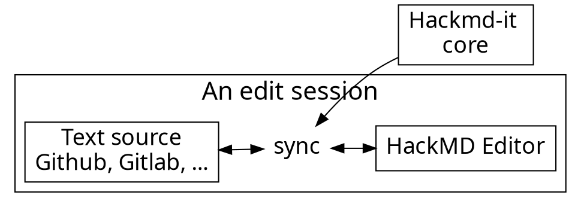

<style>
    .left {
        text-align: left;
    }
    .smol {
        font-size: 24px;
    }
    .reveal pre {
        height: 100%;
        width: 100%;
    }
</style>


slides available here
https://tinyurl.com/subsquid-moonbeam

---

# Who am I?

### Massimo Luraschi

### Developer Advocate @ Subsquid.io

*  [@RaekwonIII](https://twitter.com/RaekwonIII) 
*  RaekwonIII#3962 
*  [@RaekwonTheChefIII](https://t.me/RaekwonTheChefIII) 
*  [RaekwonIII](https://github.com/RaekwonIII) 

---

  
## Blockchain data problems (1)


Projects need custom data analysis for informed decision making

----

## Blockchain data problems (2)

* Very limited Rust-based chain analysis
  * Unreadable data, need cleaning up
* No complex logic with basic RPC calls
* Many middlewares only help **accessing** data
  * Weak support for complex business logic

---

## Subsquid’s Architecture (1)


----

## Subsquid’s Architecture (2)

* Archives index blockchain data
* Define custom business logic in Squids
* Tokenomics guarantee decentralization
  * Robustness, resilience, incorruptibility

Note:
* Faster than RPC calls
* No sync wait times

---

## Subsquid, the most flexible API SDK

* Unified Substrate and EVM indexing
* Easy setup, local development
* Fast sync times
* Built-in GraphQL server

*Build and deploy production-ready APIs within *hours**

Note:
* Can track both Substrate Events/Extrinsics AND Evm data in the same API
* It's much easier to test, break things, start, stop the server
* Fast sync times, because the raw indexing is done by Archives

----

## Full control of your API

* Define database schema
* Add external libs to project
  * Call Coingecko API to fetch prices? ✅
* Extensions via custom resolvers

---

## How: built for devs, by devs

* Automated tools for scaffolding
* Type-safety of TypeScript
* Robustness against Runtime upgrades
* Serverless deployment

*As simple as possible, as complex as you can*

Note:
- Generate models from GraphQL schema
- Generate interfaces for Substrate entities
- TypeScript was born to reduce bugs and help isolate 
- Generated interfaces track Runtime changes

---

## Automate, automate everything…


---

## Codegen

#### TypeScript models of schema entities

#### (ORM abstraction layer)

1. Customize schema
2. Launch `sqd codegen` command
3. Generate TypeScript classes, representing Entities

---

## Typegen (Substrate)

<!-- #### Type-safe wrappers for Events/Extrinsics/Storage items -->

#### 👋Runtime upgrade bugs

1. Launch `squid-substrate-metadata-explorer` to scan blockchain metadata
2. Edit the `typegen.json` config file
3. Launch `squid-substrate-typegen` command to generate TypeScript interfaces
  * "Aware" of Runtime version changes

----

## Typegen (EVM)

1. Download the ERC*** ABI in JSON format
2. Launch `squid-evm-typegen`
3. Generate TypeScript interfaces and methods to decode EVM calls

---

## Get coding!

#### Define functions to handle Events/Extrinsics/Storage Items

* Functions must accept a `Context` argument
* Use `Context` to decode Events
* `Context` has access to `Store` class for saving on the database
* Custom business logic

*As simple as you want, as complex as you can*

----

<!-- .slide: class="smol" -->

## Function anatomy

Example from the squid-template project

```typescript [1|3|4|5|6|13|]
processor.addEventHandler("balances.Transfer", processTransfer);

async function processTransfer (ctx: EventHandlerContext): Promise<void> {
  const transfer = getTransferEvent(ctx);
  const tip = ctx.extrinsic?.tip || 0n;
  const from = ss58.codec("kusama").encode(transfer.from);
  const to = ss58.codec("kusama").encode(transfer.to);

  const fromAcc = await getOrCreate(ctx.store, Account, from);
  fromAcc.balance = fromAcc.balance || 0n;
  fromAcc.balance -= transfer.amount;
  fromAcc.balance -= tip;
  await ctx.store.save(fromAcc);

  const toAcc = await getOrCreate(ctx.store, Account, to);
  toAcc.balance = toAcc.balance || 0n;
  toAcc.balance += transfer.amount;
  await ctx.store.save(toAcc);

  await ctx.store.save(
    new HistoricalBalance({
      id: `${ctx.event.id}-to`,
      account: fromAcc,
      balance: fromAcc.balance,
      date: new Date(ctx.block.timestamp),
    })
  );

  await ctx.store.save(
    new HistoricalBalance({
      id: `${ctx.event.id}-from`,
      account: toAcc,
      balance: toAcc.balance,
      date: new Date(ctx.block.timestamp),
    })
  );
}
```

---

## GraphQL endpoint

#### …with zero additional effort 😉


---

## Resources

* Docs: https://docs.subsquid.io
* Moonbeam docs:
  https://docs.moonbeam.network/builders/integrations/indexers/subsquid/
* Template project:
  https://github.com/subsquid/squid-template
* Aquarium
  https://app.subsquid.io/aquarium
* Stackexchange (subsquid tag):
  https://substrate.stackexchange.com/
* Tech community: [SquidDevs Telegram](https://t.me/HydraDevs) group, [Discord](https://discord.gg/dxR4wNgdjV) server 

---

# Let’s get coding…🦑

---

## Goal: ERC721 tracker

1. Setup<!-- .element: class="fragment" -->
2. Review the schema<!-- .element: class="fragment" -->
3. Generate models<!-- .element: class="fragment" -->
4. Generate Interfaces<!-- .element: class="fragment" -->
5. Implement logic in Processor<!-- .element: class="fragment" -->
6. Launch database container<!-- .element: class="fragment" -->
7. Create and apply database migration<!-- .element: class="fragment" -->
8. Launch processor and GraphQL server<!-- .element: class="fragment" -->

---

<!-- .slide: class="smol" -->
<!-- .slide: class="left" -->

# Setup

* Requisites: [Node.js](https://nodejs.org/en/download/) (16 or later), [Docker](https://docs.docker.com/get-docker/)

* GitHub [template](https://github.com/subsquid/squid-template), *Use this template*, then

```bash
git clone git@github.com:<account>/squid-template.git
```

* Install dependencies from project's root folder

```bash
cd squid-template && npm i
``` 

* Install additional dependencies

```bash
npm i @ethersproject/abi ethers @subsquid/substrate-evm-processor @subsquid/evm-typegen
```

<!-- 

## Bonus points: Makefile

Useful because it provides shortcuts (I can never remember command names)

```cmake [2|5|9-12]
# ...
typegen: moonbeamVersions.json
	@npx squid-substrate-typegen typegen.json

moonbeamVersions.json:
	@make explore

explore:
	@npx squid-substrate-metadata-explorer \
		--chain wss://wss.api.moonriver.moonbeam.network \
		--archive https://moonriver-beta.indexer.gc.subsquid.io/v4/graphql \
		--out moonbeamVersions.json
# ...
```

-->

---

<!-- .slide: class="smol" -->
<!-- .slide: class="left" -->

# Codegen (schema)

Define entities we want to track in `schema.graphql` file in the project root folder

* Token (and token transfers)
* Ownership of tokens
* Contracts and their minted tokens

```graphql=
type Token @entity {
  id: ID!
  owner: Owner
  uri: String
  transfers: [Transfer!]! @derivedFrom(field: "token")
  contract: Contract
}

type Owner @entity {
  id: ID!
  ownedTokens: [Token!]! @derivedFrom(field: "owner")
  balance: BigInt
}

type Contract @entity {
  id: ID!
  name: String
  symbol: String
  totalSupply: BigInt
  mintedTokens: [Token!]! @derivedFrom(field: "contract")
}

type Transfer @entity {
  id: ID!
  token: Token!
  from: Owner
  to: Owner
  timestamp: BigInt!
  block: Int!
  transactionHash: String!
}
```

----

<!-- .slide: class="smol" -->
<!-- .slide: class="left" -->

# Codegen (proj structure)

* From project's root folder, launch 
```bash
npx sqd codegen  # or `make codegen`
```
* New files will be created 

----

<!-- .slide: class="smol" -->
<!-- .slide: class="left" -->

# Codegen (classes)

### Let's take the `Owner` entity as an example

```typescript=
import {Entity as Entity_, Column as Column_, PrimaryColumn as PrimaryColumn_, OneToMany as OneToMany_} from "typeorm"
import * as marshal from "./marshal"
import {Token} from "./token.model"

@Entity_()
export class Owner {
  constructor(props?: Partial<Owner>) {
    Object.assign(this, props)
  }

  @PrimaryColumn_()
  id!: string

  @OneToMany_(() => Token, e => e.owner)
  ownedTokens!: Token[]

  @Column_("numeric", {transformer: marshal.bigintTransformer, nullable: true})
  balance!: bigint | undefined | null
}

```

---

<!-- .slide: class="smol" -->
<!-- .slide: class="left" -->

# EVM Typegen

* We need the ERC721 ABI to be able to process its logs
* Copy it from [here](https://raw.githubusercontent.com/subsquid/squid/master/test/moonsama-erc721/erc721.json) (or source it elsewhere)
* Create a `src/abi` folder to contain all ABIs
* Paste it into a file named `ERC721.json` in `src/abi`
* From project root folder, launch
```bash
npx squid-evm-typegen --abi src/abi/ERC721.json --output src/abi/erc721.ts
```

Note:
  https://github.com/PureStake/moonbeam-docs/blob/master/.snippets/code/subsquid/erc721.md

----

## TypeScript and linting config

We may need to add this section to the `tsconfig.json`:

```json=
{
  "compilerOptions": {
    ...
    "resolveJsonModule": true
  },
  ...
}
```

And add these configurations to the `.eslint` file:

```typescript=
{
    "prettier/prettier": "off",
    "@typescript-eslint/no-unsafe-assignment": "off",
    "@typescript-eslint/no-unsafe-call": "off",
    "@typescript-eslint/no-unsafe-member-access": "off",
}
```

---

<!-- .slide: class="smol" -->
<!-- .slide: class="left" -->

# Contract

Let's create a new `src/contract.ts` file to handle...well...the Contract :smile: 

```typescript=
import { assertNotNull, Store } from "@subsquid/substrate-evm-processor";
import { ethers } from "ethers";
import * as erc721 from "./abi/erc721";
import { Contract } from "./model";
 
export const CHAIN_NODE = "wss://wss.api.moonriver.moonbeam.network";

export const contract = new ethers.Contract(
  "0xb654611f84a8dc429ba3cb4fda9fad236c505a1a",
  erc721.abi,
  new ethers.providers.WebSocketProvider(assertNotNull(CHAIN_NODE))
);
 
export function createContractEntity(): Contract {
  return new Contract({
    id: contract.address,
    name: "Moonsama",
    symbol: "MSAMA",
    totalSupply: 1000n,
  });
}
 
let contractEntity: Contract | undefined;
 
export async function getContractEntity({
  store,
}: {
  store: Store;
}): Promise<Contract> {
  if (contractEntity == null) {
    contractEntity = await store.get(Contract, contract.address);
  }
  return assertNotNull(contractEntity);
}

```

---

<!-- .slide: class="smol" -->
<!-- .slide: class="left" -->

# Processor logic

Processor logic needs to be changed, as it is no longer handling Substrate Events, but EVM logs. Let's change the file like so:

```typescript=
import {
  EvmLogHandlerContext,
  SubstrateEvmProcessor,
} from "@subsquid/substrate-evm-processor";
import { lookupArchive } from "@subsquid/archive-registry";
import { CHAIN_NODE, contract, createContractEntity, getContractEntity } from "./contract";
import { events } from "./abi/erc721";
import { Owner, Token, Transfer } from "./model";

const processor = new SubstrateEvmProcessor("erc721");

processor.setDataSource({
  chain: CHAIN_NODE,
  archive: lookupArchive("moonbeam")[0].url,
});

processor.addPreHook({ range: { from: 0, to: 0 } }, async (ctx) => {
  await ctx.store.save(createContractEntity());
});

processor.addEvmLogHandler(
  contract.address,
  {
    filter: [events["Transfer(address,address,uint256)"].topic],
  },
  processTransfer
);

processor.run();

async function processTransfer(ctx: EvmLogHandlerContext): Promise<void> {
  const transfer =
    events["Transfer(address,address,uint256)"].decode(ctx);

  let from = await ctx.store.get(Owner, transfer.from);
  if (from == null) {
    from = new Owner({ id: transfer.from, balance: 0n });
    await ctx.store.save(from);
  }

  let to = await ctx.store.get(Owner, transfer.to);
  if (to == null) {
    to = new Owner({ id: transfer.to, balance: 0n });
    await ctx.store.save(to);
  }

  let token = await ctx.store.get(Token, transfer.tokenId.toString());
  if (token == null) {
    token = new Token({
      id: transfer.tokenId.toString(),
      uri: await contract.tokenURI(transfer.tokenId),
      contract: await getContractEntity(ctx),
      owner: to,
    });
    await ctx.store.save(token);
  } else {
    token.owner = to;
    await ctx.store.save(token);
  }

  await ctx.store.save(
    new Transfer({
      id: ctx.txHash,
      token,
      from,
      to,
      timestamp: BigInt(ctx.substrate.block.timestamp),
      block: ctx.substrate.block.height,
      transactionHash: ctx.txHash,
    })
  );
}

```

---

<!-- .slide: class="smol" -->
<!-- .slide: class="left" -->

# Database

* Squid APIs need a database to store processed data
* Templates have `docker-compose.yml` file to launch a container
* From project's root folder, launch 
```bash
docker-compose up
```
* or, alternatively
```bash
make up
```

---

<!-- .slide: class="smol" -->
<!-- .slide: class="left" -->

# Create and apply database migration

* Build code

```bash=
npm run build
```

* Clean up existing migrations

```bash=
rm db/migrations/*.js
```

* Drop database (and create new one)

```bash=
sqd db drop
sqd db create
```

* Create and apply new migration

```bash=
sqd db create-migration Initial # make migration
sqd db migrate # make migrate
```

---

<!-- .slide: class="smol" -->
<!-- .slide: class="left" -->

# Launch the project

The project consists of a Processor (which we just implemented) and a GraphQL server.

* Launch the Processor (this will lock the console window)

```bash=
node -r dotenv/config lib/processor.js # make process
```

* Launch the GraphQL server (in another console window)

```bash=
npx squid-graphql-server # make serve
```

* Open the browser at http://localhost:4350/graphql

---

## Good news everyone!


This project is actually available as an EVM-template

https://github.com/subsquid/squid-evm-template

---

## Adapt and create

* Get contract: https://moonbeam.moonscan.io/tokens-nft
* Change `CHAIN_NODE` in `contract.ts` (`"wss://wss.api.moonbeam.network"`)
* Change `archive` arg of `processor.setDataSource` in `processor.ts`
* Optional
  * change ABI
  * change EVM call signature

💣💣💣

---

# Thank you 🦑


Follow the project on GitHub
https://github.com/subsquid/squid


Give us a ⭐, would you?

<!-- 

## Typegen (metadata explore)

If we set up the `Makefile`, in a console window, from the project root, launch:

```bash
make explore
```

Use the full command otherwise:

```bash
npx squid-substrate-metadata-explorer \
		--chain wss://wss.api.moonriver.moonbeam.network \
		--archive https://moonriver-beta.indexer.gc.subsquid.io/v4/graphql \
		--out moonbeamVersions.json
```

[](https://gyazo.com/48fbc8c063f07a7623994144082e4855)

-->

<!-- 
## Typegen (`typegen.json`) and command

Edit the `typegen.json` file like so

```json=
{
  "outDir": "src/types",
  "chainVersions": "kusamaVersions.json",
  "typesBundle": "kusama",
  "events": [
    "balances.Transfer"
  ],
  "calls": []
}
```

And launch

```bash
make typegen
```

Or, alternatively

```bash
npx squid-substrate-typegen typegen.json
```
 -->
 
<!-- 
## Typegen (proj structure)

 -->

<!-- 
## Typegen (interfaces)

```typescript=
export class BalancesTransferEvent {
  constructor(private ctx: EventContext) {
    assert(this.ctx.event.name === 'balances.Transfer')
  }

  /**
   *  Transfer succeeded (from, to, value, fees).
   */
  get isV1020(): boolean {
    return this.ctx._chain.getEventHash('balances.Transfer') === '72e6f0d399a72f77551d560f52df25d757e0643d0192b3bc837cbd91b6f36b27'
  }

  /**
   *  Transfer succeeded (from, to, value, fees).
   */
  get asV1020(): [Uint8Array, Uint8Array, bigint, bigint] {
    assert(this.isV1020)
    return this.ctx._chain.decodeEvent(this.ctx.event)
  }

  /**
   *  Transfer succeeded (from, to, value).
   */
  get isV1050(): boolean {
    return this.ctx._chain.getEventHash('balances.Transfer') === 'dad2bcdca357505fa3c7832085d0db53ce6f902bd9f5b52823ee8791d351872c'
  }

  /**
   *  Transfer succeeded (from, to, value).
   */
  get asV1050(): [Uint8Array, Uint8Array, bigint] {
    assert(this.isV1050)
    return this.ctx._chain.decodeEvent(this.ctx.event)
  }

  /**
   * Transfer succeeded.
   */
  get isV9130(): boolean {
    return this.ctx._chain.getEventHash('balances.Transfer') === '0ffdf35c495114c2d42a8bf6c241483fd5334ca0198662e14480ad040f1e3a66'
  }

  /**
   * Transfer succeeded.
   */
  get asV9130(): {from: v9130.AccountId32, to: v9130.AccountId32, amount: bigint} {
    assert(this.isV9130)
    return this.ctx._chain.decodeEvent(this.ctx.event)
  }

  get isLatest(): boolean {
    deprecateLatest()
    return this.isV9130
  }

  get asLatest(): {from: v9130.AccountId32, to: v9130.AccountId32, amount: bigint} {
    deprecateLatest()
    return this.asV9130
  }
}
``` 
 -->
<!-- 

 -->